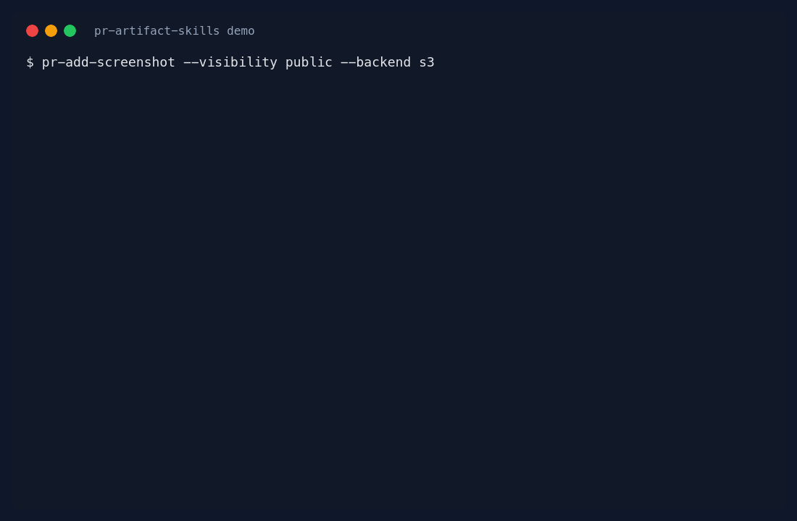

# PR Artifact Skills

Codex skills for publishing local PR artifacts to object storage and adding the link or metadata to a GitHub pull request.



## Install

Install every skill:

```sh
npx skills add adrianmross/pr-artifact-skills --all -g
```

Install one skill:

```sh
npx skills add adrianmross/pr-artifact-skills --skill pr-add-screenshot -g -y
```

The repo is also a Codex plugin package. Clone it or download a release archive and install from the repo root containing `.codex-plugin/plugin.json`.

## What It Provides

- `pr-add-artifact`: generic artifact publisher.
- `pr-add-screenshot`: screenshot/image defaults.
- `pr-add-test-report`: test and Playwright report defaults.
- `pr-add-sbom`: private SBOM/provenance defaults.

Storage defaults to generic S3-compatible APIs for MinIO, RustFS, AWS S3, and similar services. OCI Object Storage is supported when OCI CLI auth is the right path.

Visibility is explicit: `public`, `signed`, or `private`. SBOMs, provenance, logs, and coverage stay private unless public publishing is intentionally overridden.

## Test

```sh
make test
```
